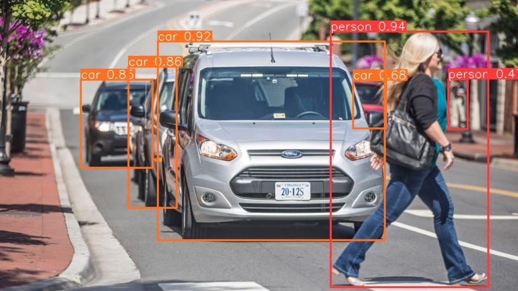
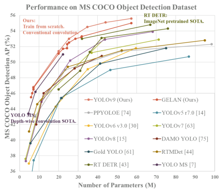

# object_detection

Deploy and Run a cars and humans object detection service locally using brand new YOLOv9.

For more information on the YOLOv9 model and its performance, see the original paper: [YOLOv9: Learning What You Want to Learn Using Programmable Gradient Information](https://example.com/yolov9_paper)